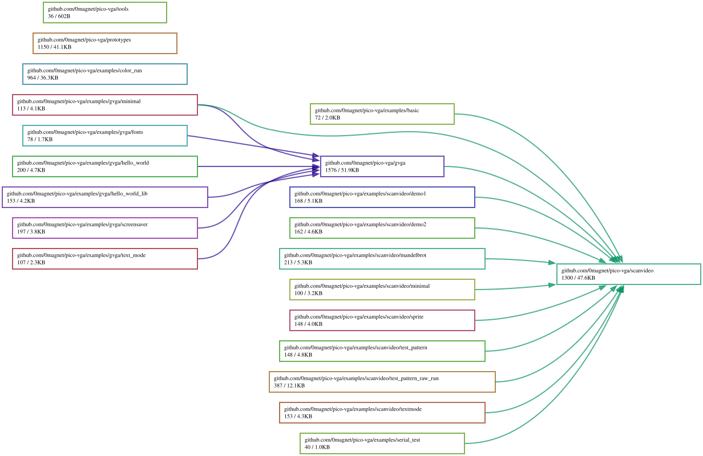

# pico-vga

**Work in progress.** VGA signal generation on the Raspberry Pi Pico (RP2040),
written in Go and built with TinyGo.

Nothing here is finished. Branches hold several parallel attempts at the same
problem, some of which produce a picture and some of which do not — see
[BRANCHES.md](BRANCHES.md) for what each one is and which are worth flashing
first. Expect the state of `main` to move.

## What it does

Drives a VGA display directly from the RP2040 using the PIO state machines for
sync and pixel output, with DMA feeding scanlines, so the CPU is not
bit-banging the signal. Target hardware is a Pico on the **Pimoroni Pico VGA
Demo Base**.

Two layers, mirroring the arrangement the C libraries below use:

- `scanvideo/` — timing, composable scanline PIO programs, the DMA/IRQ driver
- `gvga/` — a higher-level graphics layer built on top of it

## Prior art this follows

The design is not original. It reimplements, in Go, the approach worked out by
two existing C projects, and the structure deliberately mirrors theirs so the
two can be compared side by side:

- **[pico-extras](https://github.com/raspberrypi/pico-extras)** `scanvideo` —
  Raspberry Pi's scanline video library. The composable-scanline format, the
  timing/RGB state machine split and the DMA-driven scanline buffers all come
  from here (`scanvideo.c`, `timing.pio`, `composable.pio`). Related examples
  live in [pico-playground](https://github.com/raspberrypi/pico-playground).
- **[GVga](https://github.com/drfrancintosh/GVga)** by drfrancintosh — a
  graphics library layered over scanvideo. The `gvga/` package follows its
  colour modes and framebuffer handling.

Both are C and both are the reference for what correct output looks like. Some
branches carry compiled `.uf2` images of the original C examples under
`c_examples/`, kept purely so the Go output can be diffed against known-good
hardware behaviour.

Credit for the underlying technique belongs to those projects; the bugs here
are mine.

## Building

Requires [TinyGo](https://tinygo.org/) and uses
[tinygo-org/pio](https://github.com/tinygo-org/pio) for the PIO programs.

```sh
tinygo build -target=pico -o out.uf2 ./examples/<name>
```

Then copy `out.uf2` to the Pico in BOOTSEL mode, or use the flash scripts some
branches provide.

## Status

Known-working milestones exist on more than one branch, and the newest branch
is not necessarily the one that produces the best picture — at one point a
working multi-core path was reverted to a stable single-core one. That is the
main thing to untangle. `BRANCHES.md` records which branch claims what.

## Licence

**GPL-3.0** — see [LICENSE](LICENSE).

This follows from the sources rather than from preference:

- `pico-extras` / `pico-playground` are **BSD-3-Clause**, and so is
  `tinygo-org/pio`. That imposes almost nothing: keep the copyright notice and
  the disclaimer, don't imply endorsement. It does not restrict what this
  project may be licensed as.
- `GVga` is **GPL-3.0**. The `gvga/` package here follows its structure and
  colour handling closely enough that treating it as covered is the honest
  reading.

BSD-3-Clause material can be distributed as part of a GPL-3.0 work, so
GPL-3.0 for the whole repository is the coherent choice while `gvga/` is
present. If `gvga/` were dropped or independently rewritten, the remainder —
which follows only BSD-licensed sources — could be released permissively
instead.

Copyright notices from the upstream projects are retained where their code is
followed directly.

## Dependency Graph

Made with [goda](https://github.com/loov/goda):

```
go run github.com/loov/goda@latest graph github.com/0magnet/pico-vga/... | dot -Tsvg -o docs/pico-vga-goda-graph.svg
```



## Lines of Code

Made with [gocloc](https://github.com/hhatto/gocloc) (excludes `vendor/`, `node_modules/`, `.git/`):

```
gocloc --not-match-d='(vendor|node_modules|\.git)' .
```

```
-------------------------------------------------------------------------------
Language                     files          blank        comment           code
-------------------------------------------------------------------------------
Go                              35           1227           1408           6227
Markdown                         6            405              0           1345
C                                1             40             10            133
YAML                             1              0             10            102
CMake                            1              7              3             19
BASH                             1              6              6             16
-------------------------------------------------------------------------------
TOTAL                           45           1685           1437           7842
-------------------------------------------------------------------------------
```
